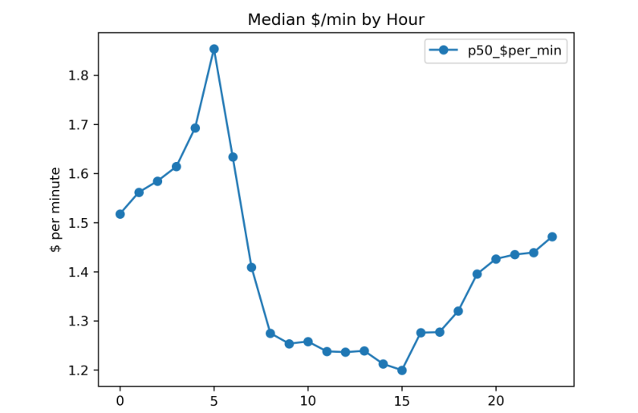
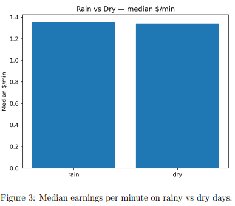

### About the project

In this project, I looked at what actually drives taxi trip efficiency in New York City, measured mainly as earnings per minute.

I built this analysis using NYC TLC Yellow Taxi trip data from 2019, combined with daily weather data from NOAA. Due to dataset size and licensing, the raw data isn’t included in this repository. This codebase reconstructs a university assignment after submission and focuses on the analysis logic and pipeline structure rather than full reproducibility.

The pipeline is written in PySpark and follows a simple flow: I load and clean the trip data, engineer efficiency and time-based features, join external weather data, explore patterns through scalable aggregations, and finish with basic predictive models. Modelling includes linear regression to predict earnings per minute and logistic regression to classify high-efficiency trips.

The code is organised into small modules that are designed to be run sequentially within a Spark session, rather than as a single monolithic script.

### Example Results

One of the clearest patterns I found was how efficiency changes across the day. Certain hours consistently produce higher median earnings per minute, while others drop off sharply, reflecting differences in demand, congestion, and trip structure.

I also explored the impact of weather. When comparing rainy and dry days, there is a noticeable difference in median earnings per minute, likely driven by changes in demand, traffic conditions, and rider behaviour.

### Author

Habib Haadi  
Data Science @ University of Melbourne  
https://github.com/habibhaadi

https://github.com/habibhaadi

